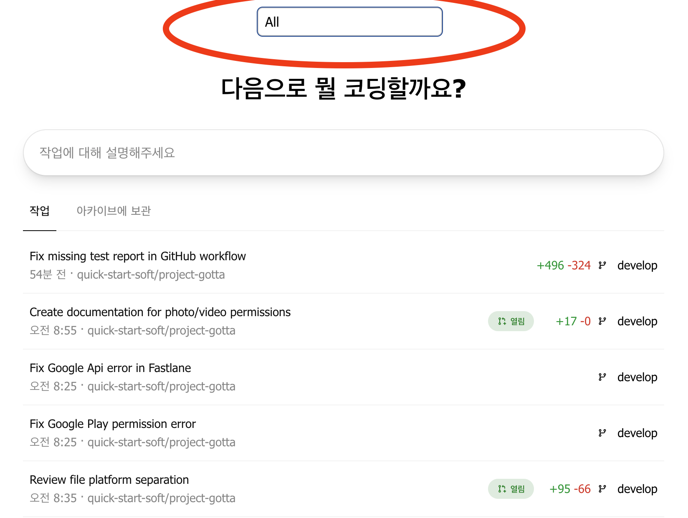
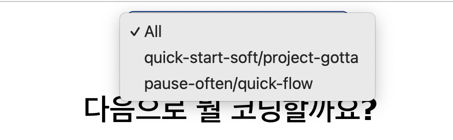
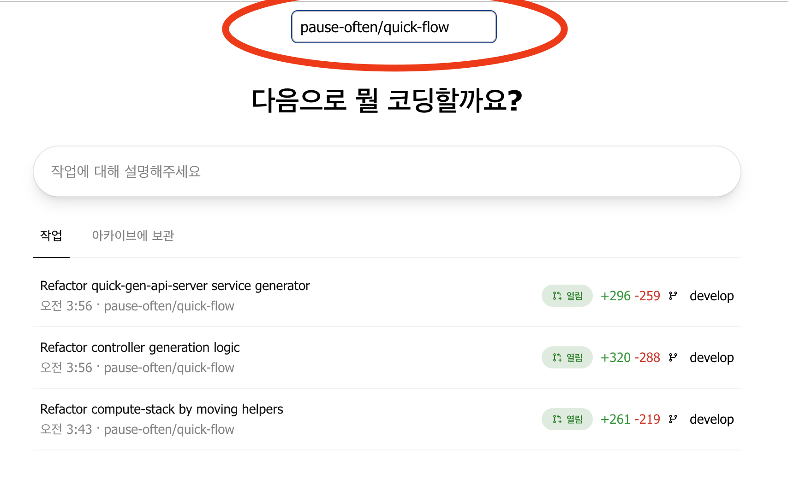

# ChatGPT Codex 작업 필터

## 개요

ChatGPT Codex 작업 필터는 `https://chatgpt.com/codex` 페이지에서 작업 목록을 프로젝트 이름으로 필터링할 수 있도록 돕는 Tampermonkey 사용자 스크립트입니다. 페이지 상단에 떠 있는 드롭다운 메뉴를 통해 원하는 프로젝트의 작업만 볼 수 있습니다.

**주요 기능:**

* **프로젝트별 필터링:** 특정 프로젝트와 관련된 작업만 빠르게 확인할 수 있습니다.
* **세션 유지:** 선택한 필터는 브라우저 세션 동안 유지됩니다.
* **동적 프로젝트 목록:** 현재 화면에 보이는 작업에서 프로젝트 이름을 자동으로 추출하여 드롭다운을 갱신합니다.

## Tampermonkey란?

Tampermonkey는 웹사이트에서 사용자 스크립트를 실행할 수 있게 해 주는 브라우저 확장 프로그램입니다. 사용자 스크립트는 웹 페이지의 레이아웃을 수정하거나 새로운 기능을 추가하는 작은 자바스크립트 코드입니다.

**Tampermonkey 사용 장점:**

* 웹사이트 동작을 원하는 대로 맞춤 설정할 수 있습니다.
* 반복 작업을 자동화할 수 있습니다.
* 즐겨 찾는 사이트의 사용성을 향상시킬 수 있습니다.

Tampermonkey에 대한 자세한 내용과 다운로드는 [Tampermonkey.net](https://www.tampermonkey.net/)에서 확인할 수 있습니다.

## 설치 가이드

ChatGPT Codex 작업 필터 스크립트를 사용하려면 다음 단계를 따르세요.

### 4.1. Tampermonkey 설치

스크립트를 설치하기 전에 먼저 Tampermonkey를 브라우저에 설치해야 합니다. Google Chrome에서 설치하는 방법은 다음과 같습니다.

1. Google Chrome을 엽니다.
2. Chrome 웹 스토어의 [Tampermonkey](https://chrome.google.com/webstore/detail/tampermonkey/dhdgffkkebhmkfjojejmpbldmpobfkfo) 페이지로 이동합니다.
3. "Chrome에 추가" 버튼을 클릭합니다.
4. 확인 대화 상자가 뜨면 "확장 프로그램 추가"를 클릭합니다.
5. 설치가 완료되면 도구 모음에 Tampermonkey 아이콘(검은색 사각형에 흰색 원 두 개)이 나타납니다.

Tampermonkey는 Firefox, Microsoft Edge, Safari, Opera 등 다른 브라우저에서도 사용할 수 있습니다. [Tampermonkey 웹사이트](https://www.tampermonkey.net/)에서 설치 방법을 확인하세요.

### 4.2. "ChatGPT Codex 작업 필터" 스크립트 설치

Tampermonkey 설치가 완료되면 "ChatGPT Codex 작업 필터" 스크립트를 추가할 수 있습니다.

**방법 1: URL 직접 접근(가능한 경우 권장)**

*스크립트가 GreasyFork나 GitHub Pages 등에 호스팅되어 있다면 해당 URL로 접속하여 설치할 수 있습니다. Tampermonkey가 자동으로 사용자 스크립트를 감지하고 설치를 안내합니다.*

1. 스크립트의 URL(예: `https://your-script-host.com/script.user.js`)로 이동합니다.
2. 스크립트 코드와 "설치" 버튼이 표시된 새 탭이 열립니다.
3. 내용을 확인한 후 "설치"를 클릭합니다.

**(참고: 이 스크립트가 로컬에만 있을 경우 해당 방법은 바로 적용되지 않을 수 있습니다. 로컬 개발에는 방법 2를 사용하세요.)**

**방법 2: 수동 복사/붙여넣기**

1. 브라우저 도구 모음에서 Tampermonkey 아이콘을 클릭합니다.
2. "새 스크립트 만들기..."를 선택합니다.
3. 기본 스크립트 템플릿이 열린 새 탭에서 모든 내용을 지웁니다.
4. [`script.js`](script.js) 파일을 텍스트 편집기로 열어 전체 내용을 복사합니다.
5. 복사한 코드를 Tampermonkey 편집기에 붙여넣습니다.
6. Tampermonkey 편집기 메뉴에서 "파일" -> "저장"을 선택합니다.

이제 스크립트가 설치되어 활성화됩니다.

## 스크립트 사용 방법

설치가 완료되면 `https://chatgpt.com/codex`에 접속할 때 스크립트가 자동으로 실행됩니다.

1. **필터 접근:** 작업 목록 상단 근처에 떠 있는 드롭다운 메뉴를 찾습니다.
2. **작업 필터링:**
    * 드롭다운 메뉴를 클릭하면 현재 보이는 작업에서 추출한 프로젝트 이름 목록이 표시됩니다.
    * 목록에서 프로젝트 이름을 선택합니다.
    * 선택한 프로젝트와 관련된 작업만 목록에 표시됩니다.
    * 모든 작업을 다시 보려면 드롭다운에서 "모든 프로젝트"(또는 이와 유사한 옵션)를 선택합니다.
3. **필터 유지:** 같은 세션에서 탭을 닫았다가 다시 열어도 선택한 필터가 유지됩니다.
4. **동적 프로젝트 목록:** 페이지에 새 작업이 로드되면 드롭다운도 함께 갱신됩니다. 작업이 동적으로 로드되는 경우 최신 목록을 보려면 "모든 프로젝트"를 다시 선택한 뒤 드롭다운을 열어 보세요.

## 문제 해결 / FAQ

**Q: 드롭다운 메뉴가 나타나지 않습니다.**

* **Tampermonkey가 활성화되어 있나요?** 아이콘을 클릭해 색상이 있는지 확인하세요.
* **스크립트가 활성화되어 있나요?** Tampermonkey 아이콘을 클릭한 뒤 "대시보드"에서 "ChatGPT Codex 작업 필터" 옆의 스위치가 켜져 있는지 확인하세요.
* **올바른 페이지에 있나요?** 이 스크립트는 `https://chatgpt.com/codex` 페이지에서만 동작합니다.
* **브라우저 콘솔 오류:** F12 키를 눌러 개발자 도구의 "콘솔" 탭을 열고 오류 메시지가 있는지 확인하세요.

**Q: 필터가 제대로 작동하지 않습니다.**

* **스크립트 버전:** 최신 버전인지 확인하세요.
* **작업 목록 구조:** 사이트의 HTML 구조가 크게 변경되면 스크립트가 동작하지 않을 수 있습니다. 스크립트 업데이트가 있는지 확인하세요.
* **프로젝트 이름 추출:** 작업 요소에서 프로젝트 이름을 올바르게 추출하지 못하면 필터링이 제대로 되지 않을 수 있습니다.

**Q: 드롭다운의 프로젝트 목록이 잘못되었거나 누락되었습니다.**

* 스크립트는 실행 시점에 화면에 보이는 작업을 기준으로 프로젝트 목록을 만듭니다. 스크롤하면서 작업이 동적으로 로드되는 경우 처음에는 모든 프로젝트가 표시되지 않을 수 있습니다. 페이지를 새로 고치거나 작업 목록을 한 번 더 불러와 보세요.

**Q: 스크립트를 어떻게 업데이트하나요?**

* GreasyFork와 같이 업데이트를 지원하는 URL로 설치했다면 Tampermonkey가 자동으로 업데이트를 확인합니다. 대시보드에서 스크립트의 "마지막 업데이트" 시간을 클릭해 수동으로도 확인할 수 있습니다.
* 수동으로 설치했다면 새 버전의 코드를 다시 복사해 붙여넣어야 합니다.

**Q: 스크립트를 비활성화하거나 삭제하려면 어떻게 하나요?**

1. 브라우저 도구 모음에서 Tampermonkey 아이콘을 클릭합니다.
2. "대시보드"로 이동합니다.
3. **비활성화:** "ChatGPT Codex 작업 필터" 옆의 스위치를 끔으로 설정합니다.
4. **삭제:** "ChatGPT Codex 작업 필터" 오른쪽에 있는 휴지통 아이콘을 클릭합니다.

## (선택 사항) 기여

기여를 환영합니다!

* **버그 제보:** 버그를 발견하면 재현 단계를 자세히 적어 알려주세요.
* **기능 제안:** 스크립트를 더 개선할 아이디어가 있다면 알려 주세요.

*(버그 제보나 기능 제안을 어디에서 받는지 명시해 주세요. 예: GitHub 이슈 페이지 등)*

## 라이선스

이 프로젝트는 [MIT 라이선스](https://opensource.org/licenses/MIT)에 따라 배포됩니다.
